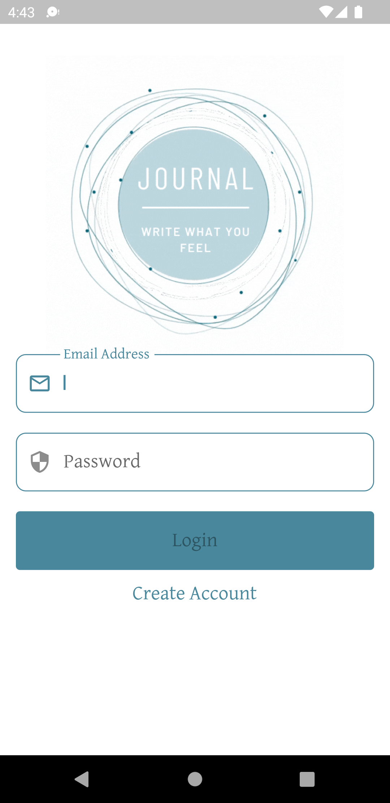
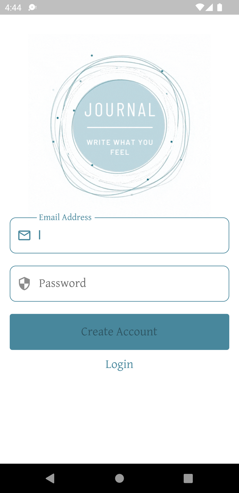
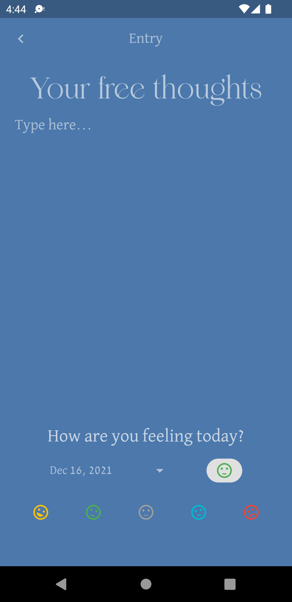
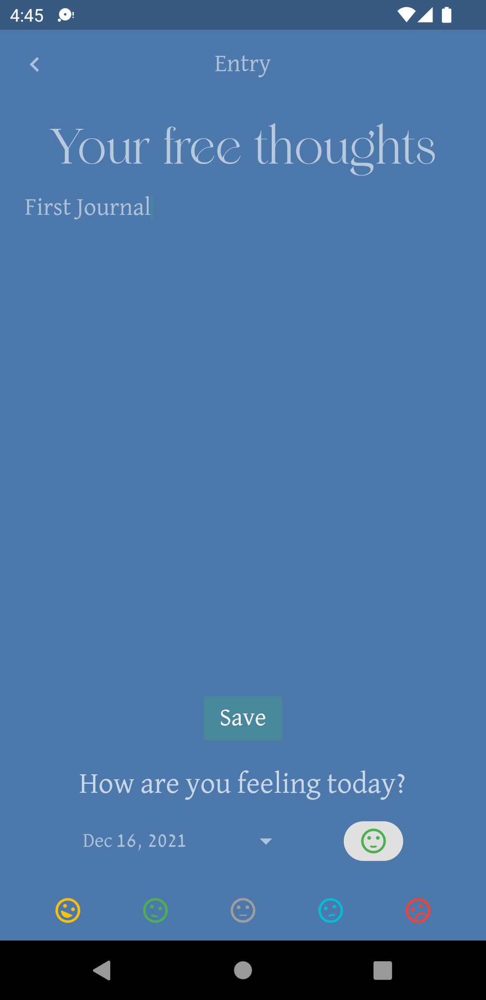
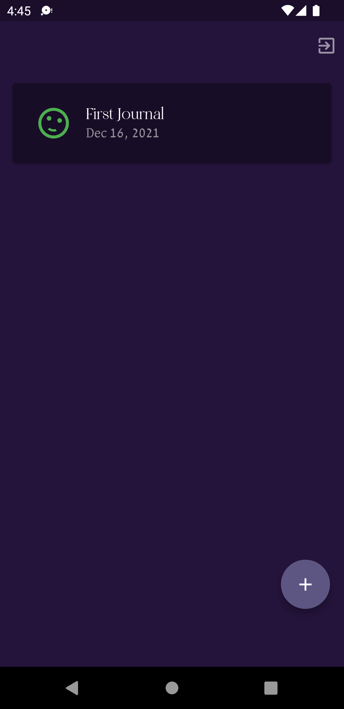

# journal

A new Flutter project.

## Getting Started

This project is a starting point for a Flutter application.

A few resources to get you started if this is your first Flutter project:

- [Lab: Write your first Flutter app](https://flutter.dev/docs/get-started/codelab)
- [Cookbook: Useful Flutter samples](https://flutter.dev/docs/cookbook)

For help getting started with Flutter, view our
[online documentation](https://flutter.dev/docs), which offers tutorials,
samples, guidance on mobile development, and a full API reference.
# journal

  
  
  
   
  
  

## Notes

### Main (`main.dart`)

This file acts as the entry point for the application. I'll explain each section in detail:

1. **Imports:**
   - `firebase_core`, `flutter/material.dart`, `google_mobile_ads`: These are package imports for Firebase, Flutter's Material Design components, and Google's mobile ads, respectively.
   - `journal/*`: These are imports from within your app's codebase, including pages like `home.dart` and `login.dart`, business logic components (`bloc`), services, and utility classes.

2. **main function:**
   - Initializes the Flutter engine (`WidgetsFlutterBinding.ensureInitialized()`).
   - Initializes Google Mobile Ads and Firebase (`MobileAds.instance.initialize()` and `Firebase.initializeApp()`).
   - Runs the app using `runApp()`, providing an `AdState` object to the entire app using a `Provider`. This ensures ads are managed app-wide.

3. **MyApp Class:**
   - A `StatefulWidget` that acts as the root of your application.
   - The `State<MyApp>` is defined by `_MyAppState`.

4. **_MyAppState Class:**
   - The `build` method:
     - Initializes Firebase again (which seems redundant and might not be necessary).
     - Creates an instance of `AuthenticationService` and `AuthenticationBloc`. These are likely used for managing user authentication.
     - Uses `AuthenticationBlocProvider` to provide the authentication state down the widget tree.
     - The `StreamBuilder` listens to the authentication bloc's user stream. Depending on the user's authentication state, it either shows the `Home` screen (for logged-in users) or the `Login` screen (for not logged-in users).

5. **_buildMaterialApp Function:**
   - A helper function to create a `MaterialApp` widget.
   - Sets basic app configurations like theme, typography, and the home page widget (`homepage`), which is either `Home` or `Login` based on the user's authentication state.
   - `debugShowCheckedModeBanner` is set to false, which removes the debug banner in the app.
   - `ThemeData` sets global visual properties for the app, like font family, text themes, and colors.

6. **Understanding the Flow:**
   - The app starts by initializing essential services (Firebase, Ads).
   - It then decides which screen to display based on the user's authentication state.
   - The use of blocs (`AuthenticationBloc`, `HomeBloc`) suggests a pattern where business logic is separated from the UI, making the code more manageable and scalable.
   - Providers (`AuthenticationBlocProvider`, `HomeBlocProvider`) are used for dependency injection and state management, making it easier to pass data down the widget tree.

7. **Interfacing with Other Parts:**
   - `AuthenticationService` and `DbFirestoreService` are likely used for interacting with backend services like Firebase.
   - The blocs (`AuthenticationBloc`, `HomeBloc`) act as intermediaries between the UI and services, handling state and business logic.
   - The `pages` (Home, Login) and `utils` (for constants, theming) are being used here to structure the UI and styling.

This file sets up the fundamental structure of your Flutter app, establishing how different parts of the app interact with each other, especially in terms of authentication and main navigation. Understanding this file is crucial for grasping the overall architecture of the app.